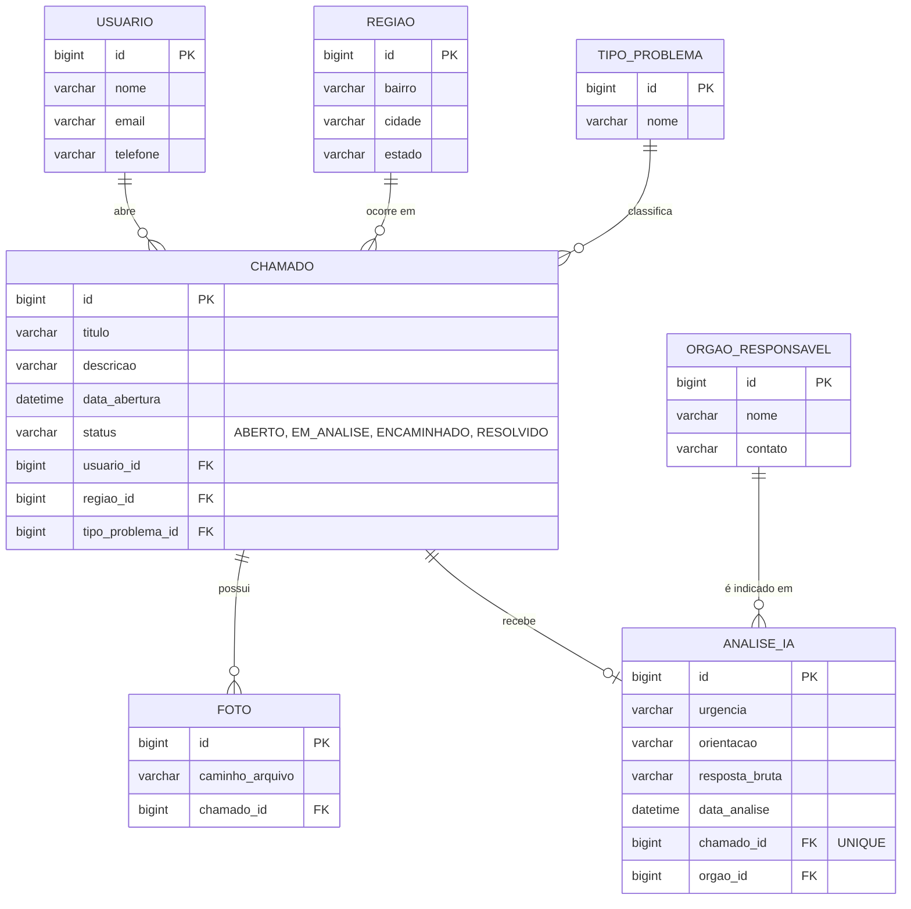

# MER - SANE IA

## Diagrama (Mermaid)

Cole o bloco abaixo em https://mermaid.live para gerar a imagem do diagrama.



## Script SQL (modelo físico, MySQL)

```sql
CREATE TABLE usuario (
    id BIGINT AUTO_INCREMENT PRIMARY KEY,
    nome VARCHAR(120) NOT NULL,
    email VARCHAR(120),
    telefone VARCHAR(20)
);

CREATE TABLE regiao (
    id BIGINT AUTO_INCREMENT PRIMARY KEY,
    bairro VARCHAR(100) NOT NULL,
    cidade VARCHAR(100) NOT NULL,
    estado CHAR(2) NOT NULL
);

CREATE TABLE tipo_problema (
    id BIGINT AUTO_INCREMENT PRIMARY KEY,
    nome VARCHAR(100) NOT NULL
);

CREATE TABLE orgao_responsavel (
    id BIGINT AUTO_INCREMENT PRIMARY KEY,
    nome VARCHAR(120) NOT NULL,
    contato VARCHAR(100)
);

CREATE TABLE chamado (
    id BIGINT AUTO_INCREMENT PRIMARY KEY,
    titulo VARCHAR(150) NOT NULL,
    descricao VARCHAR(2000),
    data_abertura DATETIME NOT NULL,
    status VARCHAR(20) NOT NULL,
    usuario_id BIGINT NOT NULL,
    regiao_id BIGINT NOT NULL,
    tipo_problema_id BIGINT NOT NULL,
    FOREIGN KEY (usuario_id) REFERENCES usuario(id),
    FOREIGN KEY (regiao_id) REFERENCES regiao(id),
    FOREIGN KEY (tipo_problema_id) REFERENCES tipo_problema(id)
);

CREATE TABLE foto (
    id BIGINT AUTO_INCREMENT PRIMARY KEY,
    caminho_arquivo VARCHAR(300) NOT NULL,
    chamado_id BIGINT NOT NULL,
    FOREIGN KEY (chamado_id) REFERENCES chamado(id)
);

CREATE TABLE analise_ia (
    id BIGINT AUTO_INCREMENT PRIMARY KEY,
    urgencia VARCHAR(20),
    orientacao VARCHAR(2000),
    resposta_bruta VARCHAR(4000),
    data_analise DATETIME,
    chamado_id BIGINT NOT NULL UNIQUE,
    orgao_id BIGINT,
    FOREIGN KEY (chamado_id) REFERENCES chamado(id),
    FOREIGN KEY (orgao_id) REFERENCES orgao_responsavel(id)
);
```
